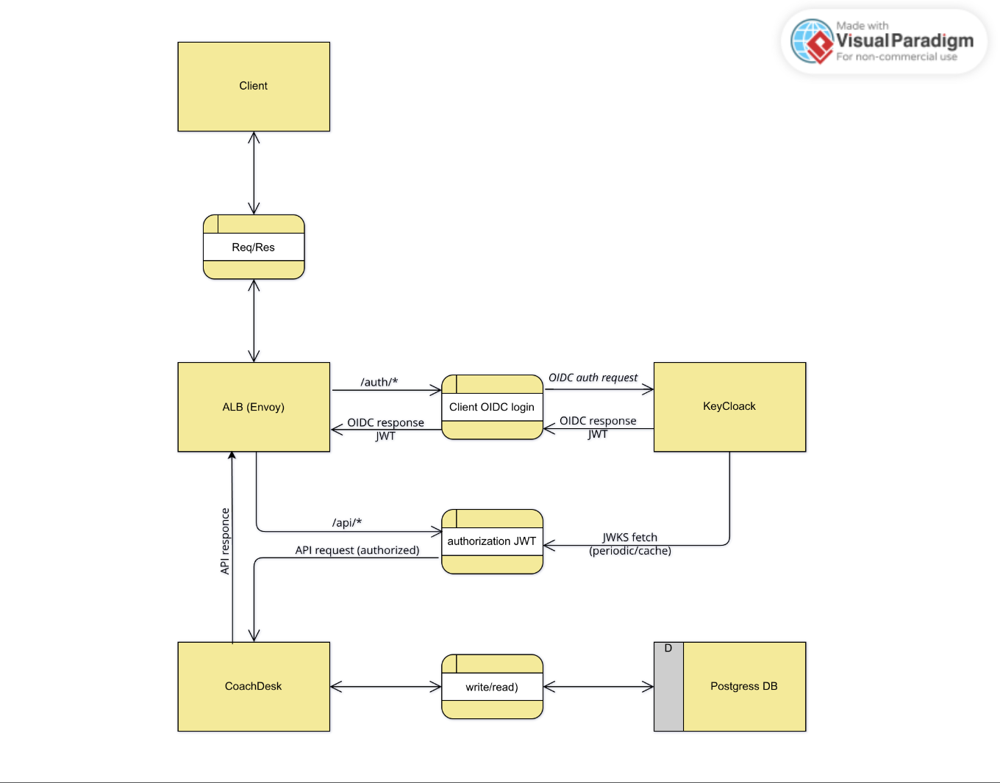

# CoachDesk

Учебный проект на Kotlin: сервис для тренеров, который помогает вести **базу клиентов**, **дневник тренировок**, **расписание** и **оплаты** в одном месте.

---

## 1) Целевая аудитория и портреты клиентов

### ЦА (в общем виде)
Фитнес-тренеры **25–50 лет** (м/ж), офлайн/онлайн/гибрид, которые ведут **10–50 клиентов** и хотят:
- быстро фиксировать тренировку (план/факт) и прогресс;
- не путаться в оплатах;
- видеть расписание на день/неделю;
- держать данные клиентов структурированно (вместо заметок/Excel/мессенджеров).

### Персоны

**Персона A — тренер в зале (офлайн)**
- Контекст: много переносов, быстрые заметки в телефоне.
- Проблема: «где записано, что мы делали прошлый раз», «кто оплатил/кто должен».
- Ценность: быстрый журнал тренировок + понятный статус оплаты.

**Персона B — самозанятый тренер (офлайн/онлайн)**
- Контекст: ведёт клиентов в разных местах/залах, часть — онлайн.
- Проблема: хаос в расписании и истории занятий, нужна система «всё в одном».
- Ценность: единая карточка клиента + история сессий + фильтры по оплатам.

---

## 2) MVP и эскиз фронтенд-представления

### MVP (минимальный полезный набор)
**Фокус:** 2 основных CRUD — *Клиенты* и *Тренировки/сессии*.

1. **Авторизация**
- Keycloak (OIDC). Клиент получает JWT и использует его как `Bearer` для API.

2. **Клиенты (CRUD)**
- создание/редактирование/удаление;
- список + поиск;
- карточка клиента (зал/заметки).

3. **Тренировки/сессии (CRUD)**
- создание плановой сессии;
- перевод статуса: `PLANNED | DONE | CANCELED`;
- фиксация результатов;
- оплата: `UNPAID | PAID` (+ сумма, дата оплаты).

4. **Расписание**
- **список по дням/неделе** + фильтры (дата/клиент/статус/оплата).

### Эскиз UI (упрощённо)

**Login**
- кнопка входа > редирект в Keycloak.

**Dashboard**
- карточки: «Сегодня», «На неделе», «Неоплаченные».
- список «Сегодня» с быстрыми действиями.

**Clients**
- таблица клиентов + поиск;
- переход в карточку.

**Client Detail**
- данные клиента (зал/заметки);
- список сессий (история/план);
- кнопка «Запланировать тренировку».

**Schedule**
- список сессий по дням;
- фильтры: дата/статус/оплата/клиент.

**Session Form**
- дата/время, тип, статус, план/результат, цена, оплата.

---

## 3) Сущности приложения (доменная модель)

> Для упрощения MVP «расписание», «посещения» и «оплаты» сведены в сущность **TrainingSession**.

### Trainer
Источник истины — Keycloak `trainerId` (subject) из JWT.
- `id` (subject из токена)
- `fullName` (опционально, из claims)
- `username/email` (опционально, из claims)

### Client
- `id`
- `trainerId` — владелец (из JWT)
- `fullName`
- `gymName?`
- `notes?`

### TrainingSession
- `id`
- `clientId`
- `startsAt` (дата+время)
- `durationMin?`
- `type` (строка/enum)
- `planNotes?`
- `resultNotes?`
- `status`: `PLANNED | DONE | CANCELED`
- `price?`
- `paymentStatus`: `UNPAID | PAID`
- `paidAt?`

---

## 4) API (POST-only / RPC)

**Base URL:** `/api`  
Все операции выполняются через `POST /api` с указанием команды в поле `op`.

**Request**
```json
{ "op": "<command>", "data": {  } }
```

**Response**
```json
{ "ok": true, "data": {  }, "error": null }
```

**Команды**

- Clients: `client.create` | `client.update` | `client.delete` | `client.get` | `client.list`
- TrainingSession: `session.create` | `session.update` | `session.delete` | `session.get` | `session.list` | `session.setStatus` | `session.pay`

## 5) Архитектурное видение

**Диаграмма (DFD/архитектура) описывает:**

- Клиент обращается к единой точке входа Envoy.
- /auth/* проксируется в Keycloak (OIDC), чтобы Keycloak не был доступен как отдельный внешний endpoint.
- /api/* пропускается в CoachDesk только при валидном Bearer JWT.
- Envoy валидирует JWT локально по ключам из JWKS (периодическая загрузка/кеш). 
- CoachDesk работает с Postgres.


[Source](docs/architecture.svg)